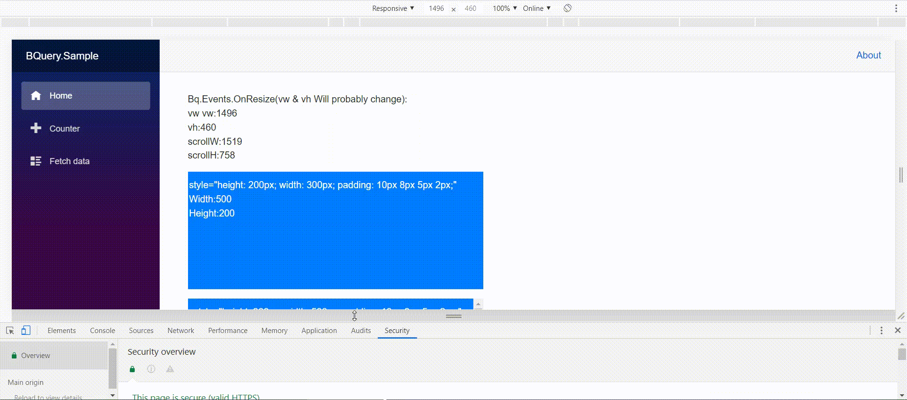
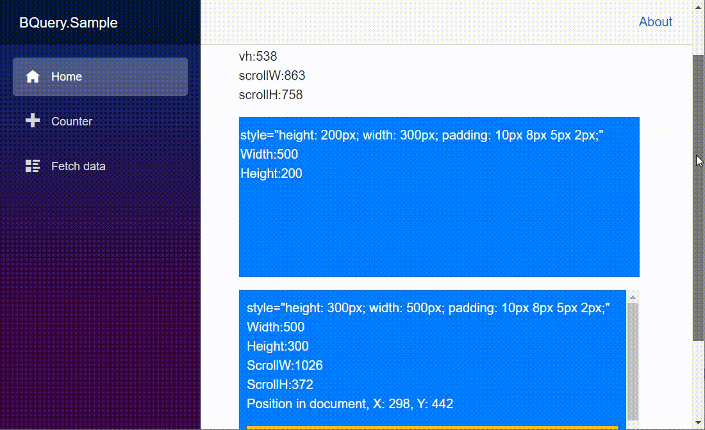

#  BQuery

An extended library of interaction between blazor and js. And The name mimics jQuery.

# Usage

## Add js:

<script src="_content/BQuery/bQuery.js"></script>

## UseBQuery

change 

```c#
await builder.Build().RunAsync();
```

to

```c#
await builder.Build().UseBQuery().RunAsync();
```

in main method.

## using namespace

```c#
using BQuery;
```

# Gif

Window on resize



Window on scroll



# Api

## `Bq.Viewport.*`

| name                                            | describe                             | return          |
| ----------------------------------------------- | ------------------------------------ | --------------- |
| `Task<double> Bq.Viewport.GetWidthAsync()`      | get viewport width                   | width           |
| `Task<double> GetHeightAsync()`                 | get viewport height                  | height          |
| `Task<double[]> GetWidthAndHeightAsync()`       | get viewport width and height        | [width, height] |
| `Task<double> GetScrollWidthAsync()`            | get viewport scroll width            | width           |
| `GetScrollHeightAsync()`                        | get viewport scroll height           | height          |
| `Task<double[]> GetScrollWidthAndHeightAsync()` | get viewport scroll width and height | [width, height] |
| `Task<double> GetScrollLeftAsync()`             | get viewport scroll left             | left            |
| `Task<double> GetScrollTopAsync()`              | get viewport scroll top              | top             |
| `Task<double[]> GetScrollLeftAndTopAsync()`     | get viewport scroll left and top     | [left, top]     |

## `Bq.Events`.*

| name                                             | describe                     | parameters        |
| ------------------------------------------------ | ---------------------------- | ----------------- |
| `event Action<double, double> OnResize`          | window.onresize event.       | 1: width 2:height |
| `event Func<double, double, Task> OnResizeAsync` | async window.onresize event. | 1: width 2:height |
| `event Action<EventArgs> OnScroll`               | window.onscroll event        | EventArgs         |
| `event Action<EventArgs> OnScrollasync`          | async window.onscroll event  | EventArgs         |

## ElementReference Extension methods

note: all the method not show the first patameter:  *this ElementReference element*

| name                                                         | describe                            | parameters                                       | return             |
| ------------------------------------------------------------ | ----------------------------------- | ------------------------------------------------ | ------------------ |
| `Task<double> GetWidthAsync(bool isOuter = true)`            | get element width                   | the width is outerwidth or innerwidth            | width              |
| `Task<double> GetHeightAsync(bool isOuter = true)`           | get element height                  | the height is outerheight or innerheight         | height             |
| `Task<double[]> GetWidthAndHeightAsync(bool isOuter = true)` | get element width and height        | the width and height is outerwidth or innerwidth | [width, height]    |
| `Task<double> GetScrollWidthAsync()`                         | get element scroll width            | --                                               | width              |
| `Task<double> GetScrollHeightAsync()`                        | get element scroll height           | --                                               | height             |
| `Task<double[]> GetScrollWidthAndHeightAsync(this ElementReference element)` | get element scroll width and height | --                                               | [width, height]    |
| `Task<double> GetScrollLeftAsync()`                          | get element scroll left             | --                                               | left               |
| `Task<double> GetScrollTopAsync()`                           | get element scroll top              | --                                               | top                |
| `Task<double[]> GetScrollLeftAndTopAsync()`                  | get element scroll left and top     | --                                               | [left, top]        |
| `Task<ElePosition> GetPositionInViewport()`                  | get element position in Viewport    | --                                               | ElePosition object |
| `Task<ElePosition> GetPositionInDoc()`                       | get element position in document    | --                                               | ElePosition object |

# Developer

zxyao

# License

MIT